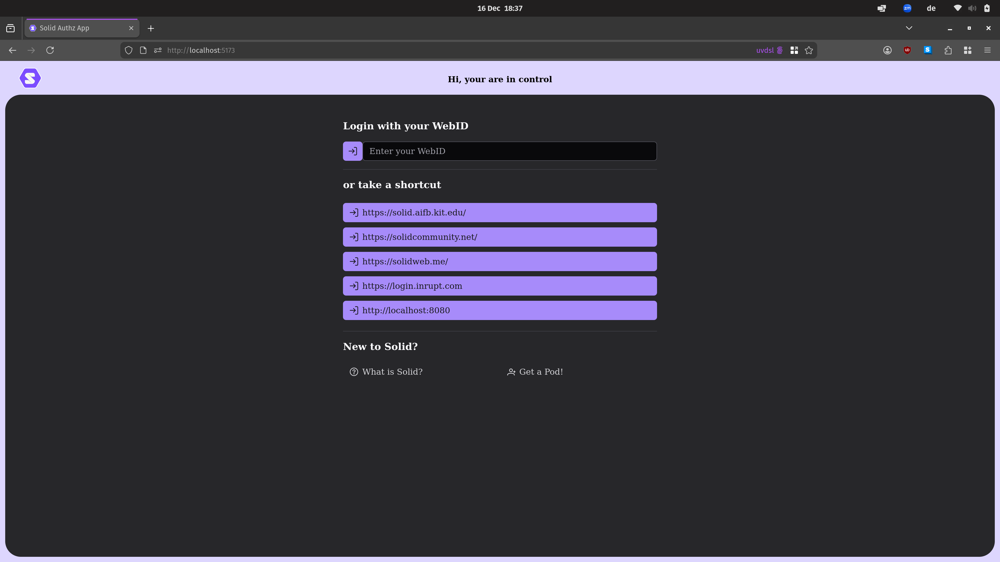
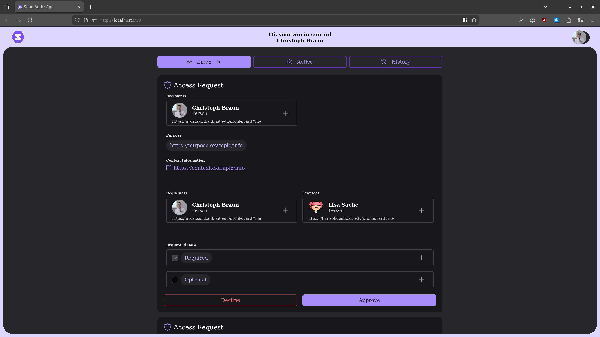
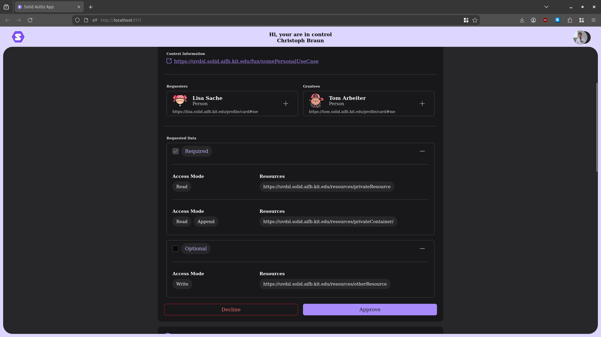
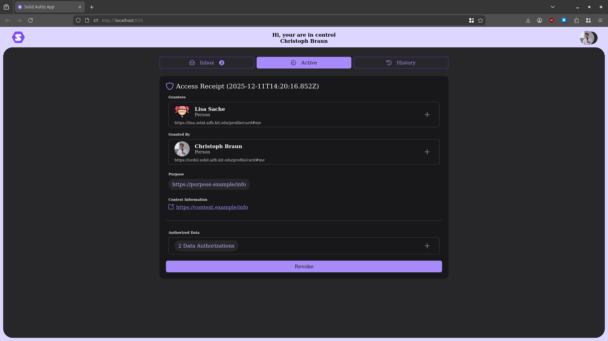
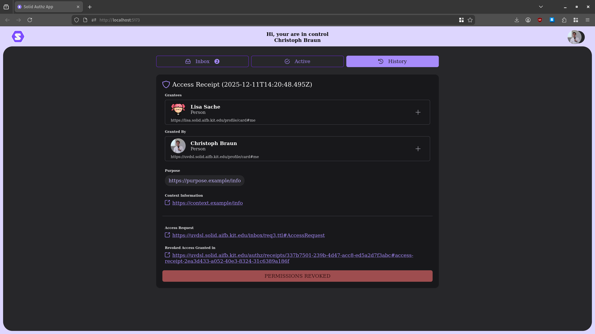
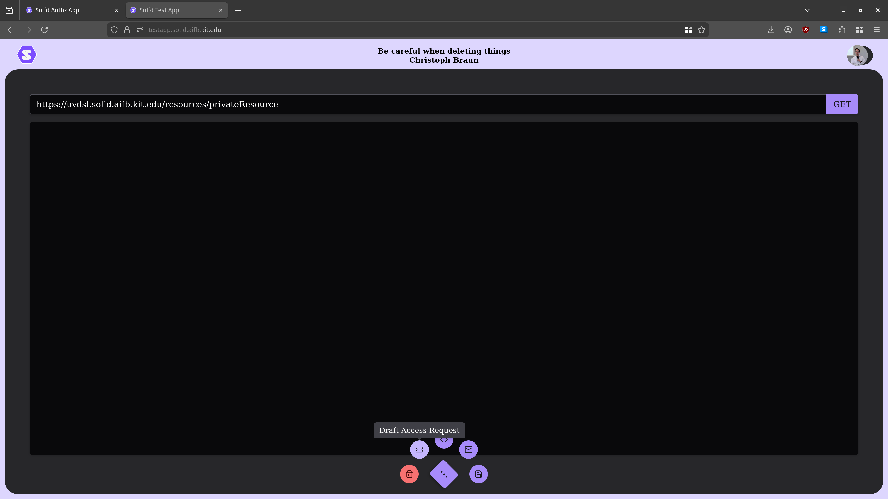
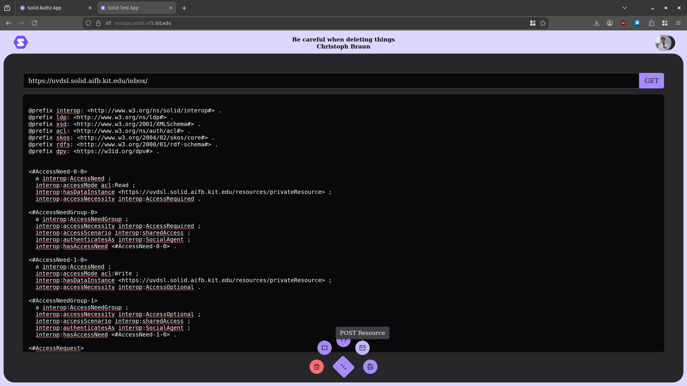
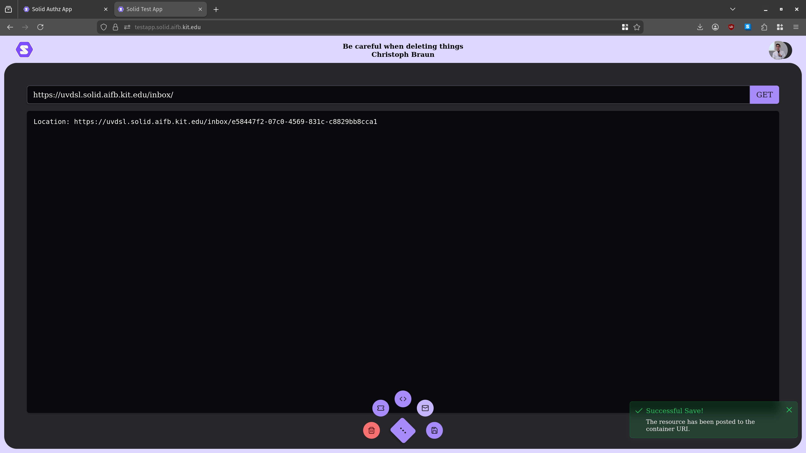

# Solid Authorization App

This is a simple Web App to control and manage access to your data following the [Solid protocol](https://solidproject.org/TR/protocol).
It assumes that access control is managed using [Web Access Control](https://solid.github.io/web-access-control-spec/).
It is far from perfect, but it is a start towards an access control app that works on the Solid Pods we have today, without requiring custom modifications.

This work is based on 
- Andreas Both, Thorsten Kastner, Dustin Yeboah, Christoph Braun, Daniel Schraudner, Sebastian Schmid, Tobias Käfer, Andreas Harth: _AuthApp - Portable, Reusable Solid App for GDPR-Compliant Access Granting._ ICWE 2024: 199-214 [[Postprint](https://publikationen.bibliothek.kit.edu/1000172187)]

but strips away some of the design decisions that make the corresponding implemenation, the [MANDAT AuthApp](https://github.com/DATEV-Research/Solid-authorization-app), not usable out-of-the-box.


## Intended Usage (Demo)

You need to log in:


### Example Flow

The app greets you with your access request inbox where you can inspect, accept or decline access requests.
We assume that your WebID profile links to an `ldp:inbox` which we expect access requests to be posted to.
If your profile does not have such a link, you need to add it yourself at the moment.



If you choose to grant access, the access request will disappear and a corresponding access receipt will be available in the `Active` Tab.
Here, you can see all the authorizations you have granted -- at least those which are associated to some access request :)
You are free to revoke granted access anytime.


When you revoke access, the access receipt is superseeded by another receipt which indicates that access has been revoked.
Such receipts are available in the `History` Tab.


Currently, we manage access receipts and corresponding authorization logs on your Pod in "hardwired" containers. This is not ideal but good enough of a start.
The [MANDAT AuthApp](https://github.com/DATEV-Research/Solid-authorization-app) chose to rely on data registries and data registrations according to SAI - but those are not available in regular Pods out-of-the-box.
Similarly, type indicies are not always present.
In fact, even our assumption of the `ldp:inbox` is not provided by default on CSS (for example).
Therefore, we -- as a community -- need to discuss and decide how to properly support finding where data lives or where data should be stored, i.e. reliable discovery.

## How to get an Access Request?

To test this AuthzApp, you need to send an access request to your `/inbox/`.
To programmatically create an access request, e.g. from your own web application, see this [little helper library](https://github.com/uvdsl/solid-access-requests).


The easiest way - without writing your own app - is to use this little [Test App](https://github.com/uvdsl/solid-test-app), conveniently deployed [here](https://testapp.solid.aifb.kit.edu/). Just be careful when deleting things, there are no safeguards -- except the "are you sure" confirmation dialog.

How to create an access request:
- log in using your Solid WebID (or use a Solid Identity Provider button as a shortcut)

Then: 
- type in the header bar the URI of the resource you want to draft an access request for. We recommend for a quick demo choosing a test resource in some container of your Pod -- this way you will be the one receiving the access request.
- click on the speed dial in the bottom center of your screen
- select the second button on the left handside, the one with the `ticket` symbol (right next to the delete button).


Then:
- the content text field will display a rough draft of a access request, requesting read access and optionally write access.
- (Note that the recipient of the access request is only a guess at this point - we are just getting started)
- the header bar will be updated with a guess of the corresponding user's inbox (note that this is just a guess!)


Then:
- if you are happy with the request (for a quick demo this should work out-of-the-box), select the speeddial button option which is the second on the right handside, the one displaying the `envelope` symbol. This will post the access request to the URI from the header bar, i.e., the inbox of the receipient.


Now, when you log into your deployment of the AuthzApp (the app in this repo), you should see the access request.


## Development
Use a somewhat recent node version, e.g. node v20.

```sh
# After cloning this repository: cd in there.
# install dependencies
npm install
# run developer mode
npm run dev
# go to http://localhost:5173
```
---
---
---
# Appendix

## The Solid Protocol

If you are new to the [Solid Project](https://solidproject.org/): Hi and welcome! :wave:

In a nutshell, the Solid Protocol is a bundle of specifications that aims to decouple _identity_ (the account you use to log in), _application_ (the app you use), and _data_ (the stuff that the app uses).

The idea is that you should be able to use the same (and mostly your) data with different applications and using an account of your choice! 

That is, the Solid Project aims to break open data silos and to enable more control over where data is stored, how it is used and by whom.

#### Where is data stored?

A user's data is stored on their Personal Online Datastore (Pod).
A Solid Pod is a Web server that adheres to the Solid Protocol.

The Solid Pod provides data under access control.
The user is in control who to grant access.

More recently, the term _Solid Pod_ is not an official term anymore. The protocol calls it _Solid Storage_ now. 
It is a more technical name and gets rid of the focus on personal data.
User's can have mulitple Pods or Storages make open a (personal) data space.

#### How do I get a Solid Pod?
Have a look at the available [Pod Providers](https://solidproject.org/users/get-a-pod), pick one, and try it.

Or, host one yourself, e.g. the [Community Solid Server](https://github.com/CommunitySolidServer/CommunitySolidServer) - but this may be a bit advanced. Important: You can host it yourself! :smile:

## Is Solid only for personal data? What about B2B?
The Solid Protocol is agnostic to the data that is stored or transmitted, it is even agonsitic to the database in which the data is actually stored.
The Solid Protocol standardizes the data access interface, authorization, authentication and agent identification.

Therefore, any data is good to be handled using the Solid Protocol!

If you want to read up on how this works in B2B environments, check out our [presentation video](https://vimeo.com/1061996736?share=copy#t=2777.533) of the [MANDAT project](https://www.ti.rw.fau.de/projects/mandat/). There is code, too; see our open source [demo repository](https://github.com/mandat-project/hackathon-demo).

And, have a look at our other publications from that project:

- Andreas Both, Thorsten Kastner, Dustin Yeboah, Christoph Braun, Daniel Schraudner, Sebastian Schmid, Tobias Käfer, Andreas Harth: _AuthApp - Portable, Reusable Solid App for GDPR-Compliant Access Granting._ ICWE 2024: 199-214 [[Postprint](https://publikationen.bibliothek.kit.edu/1000172187)]

- Andreas Both, Dustin Yeboah, Thorsten Kastner, Daniel Schraudner, Sebastian Schmid, Christoph Braun, Andreas Harth, Tobias Käfer: _Towards Solid-Based B2B Data Value Chains_. ESWC Satellite Events (1) 2024: 138-142 [[Open Access](https://2024.eswc-conferences.org/wp-content/uploads/2024/05/77770135.pdf)]

- Thorsten Kastner, Christoph Braun, Andreas Both, Dustin Yeboah, Sebastian Josef Schmid, Daniel Schraudner, Tobias Käfer, Andreas Harth: _Data-Sovereign Enterprise Collaboration using the Solid Protocol_. SEMANTiCS (Posters, Demos, Workshops & Tutorials) 2024 [[Open Access](https://ceur-ws.org/Vol-3759/paper10.pdf)]
